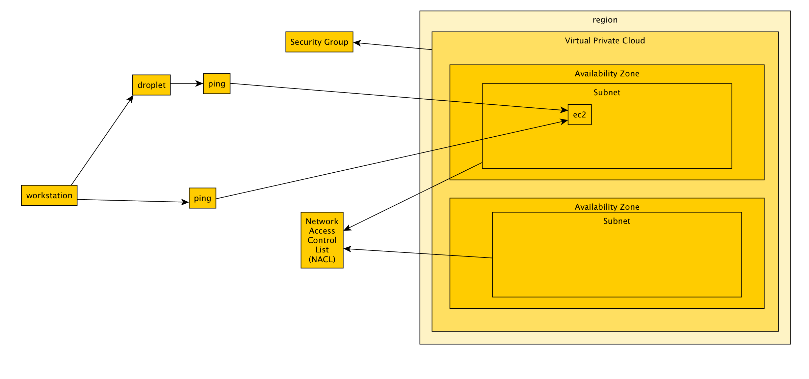

# VPC Hacking

> Exploring Amazon Web Services (AWS) Network Access Control Lists (NACL) and Security Groups

## Diagram



## Usage notes

```
tcpdump -i eth0 icmp | awk '/echo request/ { print "echo request from", $3 }'
echo request from 167.99.165.244
echo request from c-24-6-3-183.hsd1.ca.comcast.net
echo request from 167.99.165.244
echo request from c-24-6-3-183.hsd1.ca.comcast.net
echo request from 167.99.165.244
echo request from c-24-6-3-183.hsd1.ca.comcast.net
echo request from c-24-6-3-183.hsd1.ca.comcast.net
echo request from c-24-6-3-183.hsd1.ca.comcast.net
```

Key insight: the ordering matters for Network Access Control Lists, denies need to be before allows